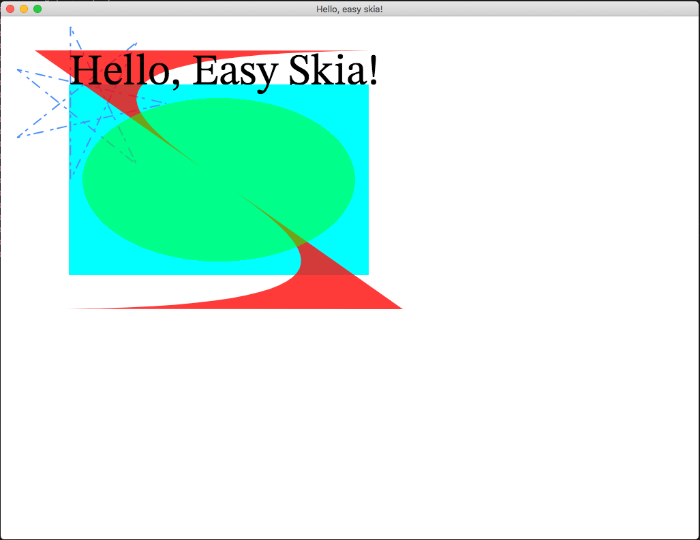

# Easy Skia (WIP)

Rust idiomatic safe bindings to Google's Skia. The Most of C API is from [mono/skia](https://github.com/mono/skia).

### DEMO

clone this repo and run `cargo run  --example hello` get a demo like below:

### TASK

- [ ] API
  - [x] basic 
  - [ ] advance
- [ ] more backend support
  - [x] cpu
  - [x] gpu
  - [ ] pdf
  - [ ] svg
  - [ ] xps
- [ ] ci
- [ ] platform support
  - [x] osx
  - [ ] linux
  - [ ] windows
  - [ ] Andorid
  - [ ] IOS
  - [ ] Web Assembly (WASM)
- [ ] Animation Player

### I need help (Contibuting)

I am very happy the basic api of skia can work, and a simple demo can run on osx. Now I want to support more api and let it work on more platform. Because I can only do this repo in my spare time, so the progress is really not fast.

I'm very glad to see any kind of pr, issues are welcome.